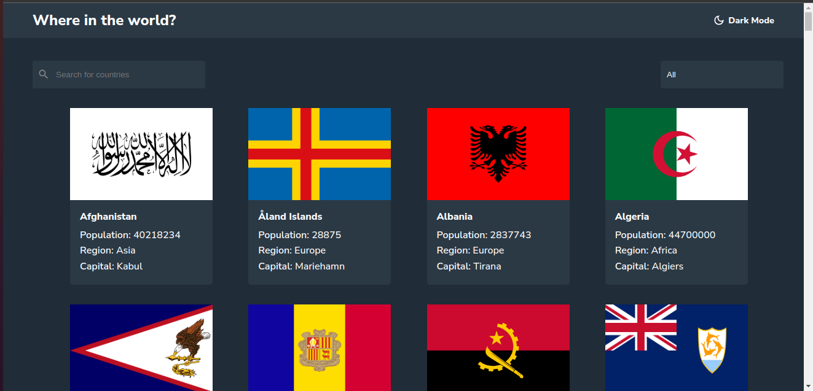

# Frontend Mentor - REST Countries API with color theme switcher solution

This is a solution to the [REST Countries API with color theme switcher challenge on Frontend Mentor](https://www.frontendmentor.io/challenges/rest-countries-api-with-color-theme-switcher-5cacc469fec04111f7b848ca). Frontend Mentor challenges help you improve your coding skills by building realistic projects. 

## Table of contents

- [Overview](#overview)
  - [The challenge](#the-challenge)
  - [Screenshot](#screenshot)
  - [Links](#links)
- [My process](#my-process)
  - [Built with](#built-with)
  - [What I learned](#what-i-learned)
  - [Continued development](#continued-development)
  - [Useful resources](#useful-resources)
- [Author](#author)
- [Acknowledgments](#acknowledgments)

**Note: Delete this note and update the table of contents based on what sections you keep.**

## Overview
A solution for rest countries api(Frontend Mentor Challenge)
### The challenge

Users should be able to:

- See all countries from the API on the homepage
- Search for a country using an `input` field
- Filter countries by region
- Click on a country to see more detailed information on a separate page
- Click through to the border countries on the detail page
- Toggle the color scheme between light and dark mode *(optional)*

### Screenshot




### Links

- Solution URL: [Add solution URL here](https://your-solution-url.com)
- Live Site URL: [Add live site URL here](https://your-live-site-url.com)


### Built with

- Semantic HTML5 markup
- CSS custom properties
- Flexbox
- CSS Grid
- Mobile-first workflow
- [React](https://reactjs.org/) - JS library
- [React-Router-DOM](https://reactrouter.com/en/main)

**Note: These are just examples. Delete this note and replace the list above with your own choices**

### What I learned

- Routing with React Router Dom
- Managing State With Context API

```js
export const ThemeContext = createContext('light');


export const ThemeProvider = ({ children }) => {

    const [theme, setTheme] = useState('light');

    const toggleTheme = () => {
        if (theme === 'light') {
            setTheme('dark')
        } else {
            setTheme('light')
        }
    }

    return (
        <ThemeContext.Provider value={{ theme, toggleTheme }}>
            {children}
        </ThemeContext.Provider>

    )
}


//  Routing

const router = createBrowserRouter([

  {
    path: "/",
    element: <App />
  },

  {
    path: "/country/:name",
    element: <CountryDetails />
  }
])


const root = ReactDOM.createRoot(document.getElementById('root'));
root.render(
  <React.StrictMode>
    <ThemeProvider>
      <RouterProvider router={router} />
    </ThemeProvider>
  </React.StrictMode>
);
```

**Note: Delete this note and the content within this section and replace with your own learnings.**

### Continued development

- Learning and Implementing Context API
- React Router DOM

### Useful resources

- [Understanding React Context API: A Guide for Beginners](https://www.linkedin.com/pulse/understanding-react-context-api-guide-beginners-pawe%C5%82-kieryk/) - This helped me for XYZ reason. I really liked this pattern and will use it going forward.

## Author

- Frontend Mentor - [@Taku-chimanaz](https://www.frontendmentor.io/profile/Taku-chimanaz)
- Twitter - [@tk_cypher-xw](https://www.twitter.com/tk_cypher_zw)
